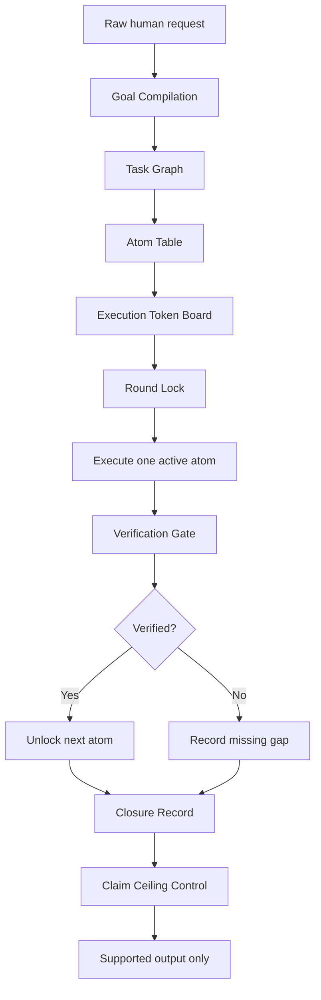

<a id="top"></a>

# 北極星目標編譯器

> Polaris Goal Compiler 的繁體中文版。
> 這是 WFGY 5.0 Polaris Protocol 底下的人機任務協議。先編譯，再執行一個 active atom。先驗證，再解鎖。只宣稱有證據支撐的完成度。

> [!IMPORTANT]
> **目前 teaser 相容性：僅 ChatGPT。**
>
> Polaris Goal Compiler 目前是以 ChatGPT 為第一個公開測試目標的 teaser component。
> 這個協議的長期設計方向是可攜式 TXT protocol，但本次 teaser release 目前只正式驗證 ChatGPT 使用情境。
>
> 其他 AI 助手、coding agent、IDE rule layer、workflow runner、未來 skill system，都屬於後續設計方向，不是本次 teaser release 的正式支援宣稱。

語言版本：[English](./README.md) | [繁體中文](./README.zh-TW.md)


[](#這是什麼)
[](./POLARIS_GOAL_COMPILER.txt)
[](#60-秒體驗)
[](../../README.md)

自然語言是很強大的介面。

但在複雜 AI 任務裡，原始自然語言不一定是安全的執行合約。

**Polaris Goal Compiler** 在人與 AI 之間加入一層協議。  
在 AI 開始產出看起來像完成品的內容之前，它必須先把使用者請求拆成可見的任務原子、目前可執行工作、被阻擋的工作、驗證門檻、真實目標，以及宣稱上限。

這不是一般提示詞模板。

這是一個可攜式 TXT 執行協議，目標是讓複雜 AI 任務更容易檢查、更不容易假完成，也更不容易在長任務中飄移。

---

## 從這裡開始

| 你想做什麼 | 連結 |
|---|---|
| 下載協議 TXT | [`POLARIS_GOAL_COMPILER.txt`](./POLARIS_GOAL_COMPILER.txt) |
| 60 秒快速體驗 | [60 秒體驗](#60-秒體驗) |
| 看它解決什麼問題 | [為什麼需要它](#為什麼需要它) |
| 看它為什麼有效 | [為什麼它有效](#為什麼它有效) |
| 看完整能力地圖 | [能力地圖](#能力地圖) |
| 閱讀 FAQ | [快速 FAQ](#快速-faq) 與 [深度 FAQ](#深度-faq) |
| 回到 Polaris 主頁 | [WFGY 5.0 Polaris Protocol](../../README.md) |

---

<a id="這是什麼"></a>

## 這是什麼

Polaris Goal Compiler 是 WFGY 5.0 Polaris 路線底下，第一個公開釋出的 protocol component。

它針對的是一種非常常見的 AI 失敗模式：

> 使用者給了一個複雜任務。  
> AI 直接開始寫漂亮答案。  
> 但真正的任務邊界，其實從來沒有被編譯、驗證、關閉。

Polaris Goal Compiler 改變的是起點。

它不是讓 AI 直接執行原始自然語言，而是要求 AI 先產出一個可檢查的執行結構。

這個結構會顯示：

| 欄位 | 意義 |
|---|---|
| Active work | 目前可以做什麼 |
| Blocked work | 目前必須等待什麼 |
| Task atoms | 最小可執行任務單位 |
| Verification gates | 解鎖下一步前必須檢查什麼 |
| Truth objects | 真正必須變成真的東西 |
| Claim ceilings | AI 目前最多可以宣稱到什麼程度 |
| Closure records | 哪些完成、缺失、部分完成、不安全 |

核心概念很簡單：

> AI 不應該只產出看起來完成的內容。  
> 它應該先暴露目前正在做什麼、什麼被阻擋、什麼已驗證，以及什麼還不能宣稱完成。

[回到頂部](#top)

---

<a id="60-秒體驗"></a>

## 60 秒體驗

你可以在大約一分鐘內測試 Polaris Goal Compiler。

### Step 1

下載：

[`POLARIS_GOAL_COMPILER.txt`](./POLARIS_GOAL_COMPILER.txt)

### Step 2

把它貼到以下任一位置：

| 位置 | 用法 |
|---|---|
| 一般 AI 聊天 | 快速手動測試 |
| Custom instructions | 讓助手長期採用這套行為 |
| Project rules | 用在 coding assistant 或 repo 層級工作 |
| Agent rule layer | 用在多步驟 agent 工作流 |
| Future skill file | 未來可包成 skill runtime |

### Step 3

對 AI 說：

```text
Use Polaris Goal Compiler.

First compile my request into task atoms.
Then execute only the active atom.
Do not claim final completion until verification is shown.
````

### Step 4

給它一個混合任務。

```text
Review this file, find the risky parts, repair the structure, verify what changed, and then write a short public release note.

Do not start writing the release note first.
Compile the task into atoms.
Show what is active and what is blocked.
Only execute the first active atom.
```

### 你應該看到什麼

AI 不應該直接跳去寫 release note。

它應該先把工作拆開。

```text
A01 Define the target
A02 Locate risky parts
A03 Repair structure
A04 Verify repair
A05 Explain verified changes
A06 Write release note
```

只有第一個已解鎖的 atom 可以被執行。

所有下游任務都應該保持 blocked，直到上游必要狀態被驗證。

[回到頂部](#top)

---

<a id="快速-faq"></a>

## 快速 FAQ

<details>
<summary>這只是提示詞嗎？</summary>

> 不是。
>
> 一般提示詞通常是在告訴模型要寫出什麼樣的答案。
>
> Polaris Goal Compiler 是在告訴 AI，在產出看起來像完成品的內容之前，應該如何編譯、拆分、授權、執行、驗證，以及限制宣稱。
>
> 它更接近執行協議，而不是寫作提示詞。

</details>

<details>
<summary>為什麼一個 TXT 檔會改變 AI 行為？</summary>

> AI 很擅長模仿與延續格式。
>
> 只要一個純 TXT 協議反覆定義任務邊界、active work、blocked work、verification gates、claim limits，就能影響 AI 的執行行為。
>
> 目標不是神奇地改造模型，而是讓模型在開始寫之前，先得到更清楚的執行合約。

</details>

<details>
<summary>這可以消滅幻覺嗎？</summary>

> 不行。
>
> Polaris Goal Compiler 的目標是降低幻覺風險、假完成、過早產生漂亮文字、以及沒有證據的完成宣稱。
>
> 它是透過讓任務邊界與驗證狀態先變得可見，來降低這些問題。

</details>

<details>
<summary>什麼時候適合使用？</summary>

> 當任務很複雜、多步驟、高風險，或很容易被 AI 假裝完成時，就適合使用。
>
> 例如 coding repair、檔案審查、audit、文件打包、release preparation、repo maintenance、長任務規劃。
>
> 如果只是一般輕鬆聊天，協議可以用 compact mode，甚至不一定需要啟動完整結構。

</details>

<details>
<summary>我第一個應該測什麼？</summary>

> 測一個混合任務。
>
> 最好同時包含 review、repair、verification、public writing。
>
> 如果 AI 一開始就直接寫最終公告，而沒有先檢查與驗證，這正是這個協議想降低的失敗模式。
>
> 好的執行應該是：先編譯、只執行一個 active atom、驗證後才解鎖下游任務。

</details>

[回到頂部](#top)

---

<a id="position-in-wfgy-50"></a>

## 在 WFGY 5.0 裡的位置

Polaris Goal Compiler 是 **WFGY 5.0 Polaris Protocol** 底下的一個公開 protocol component。

它不公開完整的 private mathematical engine。

它先釋出一個實用的人機執行層，讓使用者可以直接下載、貼上、測試。

| 層級                             | 狀態                          |
| ------------------------------ | --------------------------- |
| 人機執行協議                         | 透過 Polaris Goal Compiler 公開 |
| 可攜式 TXT 規則                     | 已公開                         |
| 未來 skill 相容性                   | 已在結構中預留                     |
| 完整 WFGY 5.0 內部引擎               | 本頁未完整公開                     |
| 未來 Polaris protocol components | 將逐步釋出                       |

這次釋出遵循 Polaris 的方向：

> 先公開實用的 protocol layer，再逐步釋出更深層的 engine materials。

[回到頂部](#top)

---

<a id="為什麼需要它"></a>

## 為什麼需要它

長任務裡，很多 AI 失敗不是發生在最後答案。

而是發生在第一刀任務邊界切錯的時候。

簡單任務，自然語言通常足夠。

複雜任務，原始自然語言可能太模糊。

使用者可能會說：

```text
Review this, fix it, verify it, and write the announcement.
```

對模型來說，這可能塌縮成一個混合任務。

AI 可能默默把它當成：

```text
review + repair + verify + explain + publish
```

然後用一個表面完整的答案包起來。

這就是假完成的開始。

| 失敗類型                      | 會發生什麼             |
| ------------------------- | ----------------- |
| Goal merging              | 多個任務變成一團模糊任務      |
| Verification skipping     | AI 寫得像已經檢查過，但其實沒有 |
| Premature prose           | 真實工作還沒完成，公開說明先出現  |
| Local to global promotion | 局部完成被說成整體完成       |
| Unsupported readiness     | 沒有證據就宣稱完成         |

Polaris Goal Compiler 的目的，就是阻止這個第一步塌縮。

它在人類請求與 AI 行動之間，放入一層 protocol。

[回到頂部](#top)

---

<a id="為什麼它有效"></a>

## 為什麼它有效

這不是魔法。

它是任務邊界控制。

AI 很擅長延續模式。
當每一輪都暴露相同的執行結構，模型就會得到一個穩定的操作節奏。

它不再只靠原始自然語言猜整個任務，而是看到一份結構化合約：

```text
What is active?
What is blocked?
What must be verified?
What is the truth object?
What is the claim ceiling?
What remains unresolved?
```

這種重複結構對 AI 很友好。

它會告訴 AI：

| 訊號                | 效果             |
| ----------------- | -------------- |
| Active atom       | 現在做這個          |
| Blocked atom      | 這個還不能做         |
| Verification gate | 先檢查，再解鎖        |
| Truth object      | 不要把漂亮文字誤當完成    |
| Claim ceiling     | 不要誇大 readiness |
| Closure record    | 保留長任務的連續性      |

白話說：

> 第一刀邊界越清楚，後面的任務越不容易飄移。

這不保證正確性。

它是透過在模型開始寫之前，先讓執行邊界變得可見，來降低幻覺與假完成風險。

[回到頂部](#top)

---

<a id="能力地圖"></a>

## 能力地圖

Polaris Goal Compiler 由多層執行控制組成。

| 能力                    | 它做什麼                          | 它防止什麼              |
| --------------------- | ----------------------------- | ------------------ |
| Goal Compilation      | 把原始自然語言轉成可執行任務結構              | 從模糊請求直接開始          |
| Task Graph            | 標記 atoms、依賴、阻擋邊、解鎖順序          | 太早跳到下游工作           |
| Count Board           | 分離任務數、package 數、active atom 數 | 把一個局部單位誤當整個任務      |
| Atom Table            | 把每個任務記錄成可見可執行單位               | 把修補、驗證、寫作混在一步      |
| Execution Token Board | 對每個 atom 授權或拒絕執行              | 執行尚未解鎖的工作          |
| Round Lock            | 每一輪鎖定一個 active atom           | 一個答案裡多任務漂移         |
| Truth Object          | 定義真正必須變成真的東西                  | 把可讀文字當成證明          |
| Claim Ceiling         | 限制 AI 能宣稱的完成強度                | 局部成功變成假全局完成        |
| Downstream Leak Audit | 偵測後段內容是否太早滲出                  | 驗證前就寫 announcement |
| Closure Record        | 記錄驗證狀態、缺口、剩餘 gap              | 長任務中途失去狀態          |
| Portable TXT Mode     | 不需要特殊 app 也能使用                | 被鎖死在單一介面           |
| Skill Compatibility   | 為未來 skill 包裝預留結構              | 讓 protocol 變成死文件   |

這套協議是為了讓複雜任務更可檢查。

它不只是叫 AI 小心一點。

它給 AI 一個結構，讓 AI 知道「小心」到底是什麼意思。

[回到頂部](#top)

---

<a id="execution-flow"></a>

## 執行流程



這個流程就是實用核心。

AI 不應該從原始請求直接跳到最終漂亮文字。

它應該通過編譯、授權、執行、驗證、關閉紀錄，以及宣稱控制。

[回到頂部](#top)

---

<a id="recommended-first-test"></a>

## 推薦第一個測試

使用一個很容易讓 AI 混合階段的任務。

```text
Use Polaris Goal Compiler.

I need you to review a file, find the risky parts, repair the structure, explain what changed, and then write a short public release note.

Do not start writing the release note first.
Compile the task into atoms.
Show what is active and what is blocked.
Only execute the first active atom.
```

好的回應不應該立刻寫 release note。

它應該先產生類似這樣的結構：

| Atom | Class              | State   |
| ---- | ------------------ | ------- |
| A01  | Define target      | Active  |
| A02  | Locate risky parts | Blocked |
| A03  | Repair structure   | Blocked |
| A04  | Verify repair      | Blocked |
| A05  | Explain changes    | Blocked |
| A06  | Write release note | Blocked |

格式可以不同。

但核心行為不應該不同：

> 先編譯。
> 只執行一個 active atom。
> 先驗證，再解鎖。
> 不要太早宣稱最終完成。

[回到頂部](#top)

---

<a id="where-to-use-it"></a>

## 可以用在哪裡

你可以在很多 AI 工作流中使用 Polaris Goal Compiler。

| 環境                      | 用法                                              |
| ----------------------- | ----------------------------------------------- |
| 一般 AI 聊天                | 貼上 TXT，請 AI 使用                                  |
| Custom instructions     | 作為長期 instruction layer                          |
| Coding assistant rules  | 放在 project rules 或 repo 層級規則                    |
| Agent workflows         | 作為任務治理 policy                                   |
| Documentation workflows | 用在 release notes、README、文件打包前                   |
| Audit workflows         | 用來分離 locate、verify、decide、write 階段              |
| Future skill systems    | 包成 functions、panels、logs 或 hidden runtime state |

最有感的場景：

| 場景                      | 為什麼有幫助                             |
| ----------------------- | ---------------------------------- |
| Coding repair           | 分離診斷、修補、驗證、解釋                      |
| File review             | 防止還沒檢查就開始總結                        |
| Documentation packaging | 把 verified facts 和 public prose 分開 |
| Release preparation     | 沒有檢查前阻擋 readiness claims           |
| Long planning           | 維持多輪任務連續性                          |
| Repository maintenance  | 防止修補、驗證、release notes 混成一團         |
| Multi round work        | 讓未完成工作可見，不被漂亮文字埋掉                  |

[回到頂部](#top)

---

<a id="hero-figure-slot"></a>

## Hero 圖位置

之後可以在這裡加入視覺效果圖。

建議圖片路徑：

```text
./assets/polaris_goal_compiler_hero.png
```

未來插入方式：

```markdown

```

建議圖表維度：

| 維度                            | 意義              |
| ----------------------------- | --------------- |
| Boundary clarity              | 任務是否在執行前被切清楚    |
| Fake completion risk          | 局部進度是否太早被宣稱為完成  |
| Verification visibility       | 檢查是否可見，或其實缺失    |
| Claim ceiling control         | AI 是否避免無證據宣稱    |
| Long task continuity          | 任務是否能跨回合追蹤      |
| Downstream leakage resistance | 下游工作是否被正確阻擋直到解鎖 |

第一張公開圖應該是 informal effect map，不是 formal benchmark claim。

[回到頂部](#top)

---

<a id="informal-effect-map"></a>

## 非正式效果地圖

這張表是一般 AI 工作流中的實用預期指南。

這不是正式 benchmark 結果。

| 使用場景                         | 預期影響           | 原因                                                  |
| ---------------------------- | -------------- | --------------------------------------------------- |
| Casual chat                  | Low            | 簡單聊天通常不需要重型任務編譯                                     |
| Simple writing               | Low to medium  | 可幫助保持 claim boundary                                |
| Multi step writing           | Medium         | 分離規劃、草稿、審查、最終輸出                                     |
| Coding repair                | Medium to high | 防止 patch、explanation、verification 混在一起              |
| Audit and review             | High           | 強制顯示 active checks、blocked items、closure records    |
| Long task packaging          | High           | 防止局部完成被升級成最終完成                                      |
| Repository maintenance       | High           | 分離 repair、verification、documentation、release claims |
| Multi round complex planning | High           | 維持多輪任務連續性                                           |

未來可以用 controlled tasks、baseline comparisons、repeated trials、clear scoring rules 加入正式測量。

[回到頂部](#top)

---

<a id="深度-faq"></a>

## 深度 FAQ

<details>
<summary>Polaris Goal Compiler 真正在解決什麼問題？</summary>

> 它解決的是任務邊界問題。
>
> 很多 AI 失敗不是從最後答案開始，而是從複雜人類請求以模糊指令進入模型時就開始。
>
> 如果 AI 不知道哪一部分是 active、哪一部分被 blocked、哪一部分需要 verification、哪一種 claim 還不能說，它就可能產出看起來完成，但實際任務還沒完成的內容。
>
> Polaris Goal Compiler 在執行前加入一層 protocol。

</details>

<details>
<summary>為什麼自然語言不足以處理複雜 AI 任務？</summary>

> 自然語言很適合溝通，但不一定是安全的執行合約。
>
> 人類可能說：「review this, fix it, verify it, and write the release note.」
>
> 對模型來說，這可能塌縮成一個混合任務。AI 可能在修補尚未驗證前，就開始寫 release note。
>
> Polaris Goal Compiler 強制請求先變成結構，再允許 AI 行動。

</details>

<details>
<summary>什麼是人機溝通協議？</summary>

> 它是人與 AI 之間共享的任務格式。
>
> 人類給出請求。
>
> AI 必須先把它編譯成可見的 task atoms、dependency edges、blocked work、verification states、claim limits。
>
> 這讓雙方都更容易檢查任務狀態。

</details>

<details>
<summary>任務原子化如何降低假完成？</summary>

> 假完成通常發生在多種任務類型被混在一起時。
>
> 例如 repair、verification、explanation、public announcement 同時出現在一個答案裡。
>
> Polaris Goal Compiler 把工作拆成 task atoms，並且每一輪只允許一個 active atom。
>
> 這會讓 AI 比較難在跳過未解決工作時，用漂亮表面包裝過去。

</details>

<details>
<summary>什麼是 claim ceiling control？</summary>

> Claim ceiling control 會限制 AI 描述完成度的強度。
>
> 如果只有局部步驟完成，AI 不能宣稱整個任務完成。
>
> 如果缺少驗證，AI 不能宣稱 verified readiness。
>
> 這可以防止局部進度被升級成假全局完成。

</details>

<details>
<summary>什麼是 downstream leakage？</summary>

> Downstream leakage 是指 AI 在上游工作還沒驗證前，就開始做後面的工作。
>
> 例子：檔案還沒真的修好，AI 就開始寫公開 release note。
>
> Polaris Goal Compiler 會透過分離 active work 和 blocked downstream work 來檢查這種情況。

</details>

<details>
<summary>為什麼重複結構能幫助 AI？</summary>

> AI 很擅長延續模式。
>
> 如果每一輪都使用穩定的執行結構，模型會得到更清楚的操作節奏。
>
> 它會看到什麼是 active、什麼被 blocked、什麼必須 verified、什麼還不能 claim。
>
> 這不會讓模型完美，但會讓任務介面更不模糊。

</details>

<details>
<summary>這可以取代驗證嗎？</summary>

> 不行。
>
> Polaris Goal Compiler 不會取代 source checking、tests、domain expertise、code execution、review、external validation。
>
> 它會讓驗證更難被跳過。
>
> 這個 protocol 的設計目標，是暴露驗證是否存在、是否缺失，以及目前是否允許 completion claim。

</details>

<details>
<summary>這是完整 WFGY 5.0 系統嗎？</summary>

> 不是。
>
> Polaris Goal Compiler 是 WFGY 5.0 Polaris Protocol 底下的一個公開 protocol component。
>
> 它不公開完整 private mathematical engine。
>
> 它先釋出一個實用的人機執行層，讓使用者可以下載、貼上、立即測試。

</details>

<details>
<summary>這未來可以變成 AI skill 嗎？</summary>

> 可以。
>
> TXT 版本刻意設計成可攜式。
>
> 未來 skill 可以把同樣結構包成 functions、panels、logs、hidden state、forms 或 runtime checks。
>
> 實作方式可以改變，但核心結構應該保留：goal compilation、task graph、atom table、execution token board、round lock、downstream leak audit、closure record、claim ceiling control。

</details>

<details>
<summary>可以用在 coding agents 嗎？</summary>

> 可以。
>
> 當 coding task 同時混合 diagnosis、patching、verification、explanation、release notes 時，它特別有用。
>
> Coding agent 可以用 Polaris Goal Compiler 分離哪些要 inspect、哪些要 change、哪些要 test，以及哪些還不能宣稱 fixed。

</details>

<details>
<summary>它的限制是什麼？</summary>

> Polaris Goal Compiler 不能讓弱模型理解所有領域。
>
> 它不能保證事實正確。
>
> 它不能取代真實測試、外部來源或專家審查。
>
> 它比較實際的目標是：降低任務模糊、暴露 blocked work、防止 premature claims，並讓 fake completion 更容易被發現。

</details>

<details>
<summary>非正式效果地圖是 benchmark 嗎？</summary>

> 不是。
>
> 非正式效果地圖是一個實用預期指南。
>
> 它幫助使用者理解這個 protocol 可能在哪些場景最有感。
>
> 正式 benchmark claims 需要 controlled tasks、baseline comparisons、repeated trials、clear scoring rules。

</details>

<details>
<summary>貢獻者應該如何擴充這個 protocol？</summary>

> 擴充應該保留核心合約。
>
> 不要移除 goal compilation、task atom separation、execution token control、round lock、downstream leak audit、truth object tracking、closure records、claim ceiling control。
>
> 新功能應該讓執行更可見、更可驗證，或更難假裝完成。
>
> 只讓輸出變漂亮的功能是不夠的。

</details>

[回到頂部](#top)

---

<a id="what-this-does-not-claim"></a>

## 這個協議不宣稱什麼

Polaris Goal Compiler 是實用且有邊界的。

它不宣稱：

| 不宣稱                                | 原因                         |
| ---------------------------------- | -------------------------- |
| Universal correctness              | 沒有協議能保證所有答案都正確             |
| Complete hallucination elimination | 目標是降低風險，不是神奇消除             |
| Replacement for tests              | 真實驗證仍然重要                   |
| Replacement for sources            | 事實性任務仍然需要證據                |
| Replacement for expertise          | 領域判斷仍然重要                   |
| Full WFGY 5.0 release              | 這只是一個公開 protocol component |
| Formal benchmark proof             | 目前效果圖是 informal，正式測量需另外進行  |

它宣稱的是：

| 宣稱                                | 意義                            |
| --------------------------------- | ----------------------------- |
| Better task boundary visibility   | AI 必須顯示 active 與 blocked work |
| Better fake completion resistance | 局部進度不能默默變成最終完成                |
| Better verification awareness     | 缺少檢查時會變得可見                    |
| Better claim control              | AI 不應該誇大 readiness            |
| Better long task continuity       | 多輪任務狀態比較容易保留                  |

一句話：

> Polaris Goal Compiler 不會讓模型全知。它會讓任務介面更難假完成。

[回到頂部](#top)

---

<a id="files"></a>

## 檔案

| 檔案                                                         | 用途                                          |
| ---------------------------------------------------------- | ------------------------------------------- |
| [`POLARIS_GOAL_COMPILER.txt`](./POLARIS_GOAL_COMPILER.txt) | 可攜式 TXT 協議。下載、貼上、直接使用。                      |
| `README.md`                                                | 英文導讀、quickstart、FAQ、protocol explanation。   |
| `README.zh-TW.md`                                          | 繁體中文導讀、quickstart、FAQ、protocol explanation。 |

建議使用方式：

```text
Download the TXT.
Paste it into your AI assistant or agent rule layer.
Ask the AI to use Polaris Goal Compiler before executing complex tasks.
```

[回到頂部](#top)

---

<a id="part-of-wfgy-50-polaris-protocol"></a>

## WFGY 5.0 Polaris Protocol 的一部分

Polaris Goal Compiler 是 WFGY 5.0 Polaris 路線底下的一個公開 protocol release。

更多 protocol components 會逐步釋出。

目標是讓 AI workflows：

| 方向                                | 意義                                   |
| --------------------------------- | ------------------------------------ |
| More structured                   | 任務先編譯，再執行                            |
| More inspectable                  | Active、blocked、verified 狀態可見         |
| Less ambiguous                    | 自然語言被轉成執行結構                          |
| Harder to fake as complete        | 完成宣稱必須尊重驗證狀態                         |
| Easier to wrap into future skills | TXT protocol 未來可變成 runtime structure |

主 Polaris 頁面：

[WFGY 5.0 Polaris Protocol](../../README.md)

Repository：

[WFGY](../../../README.md)

[回到頂部](#top)

---

## License

This protocol follows the license policy of the parent WFGY repository unless a specific file states otherwise.

Please keep attribution when reusing, adapting, or wrapping this protocol into another assistant, agent, or skill workflow.
