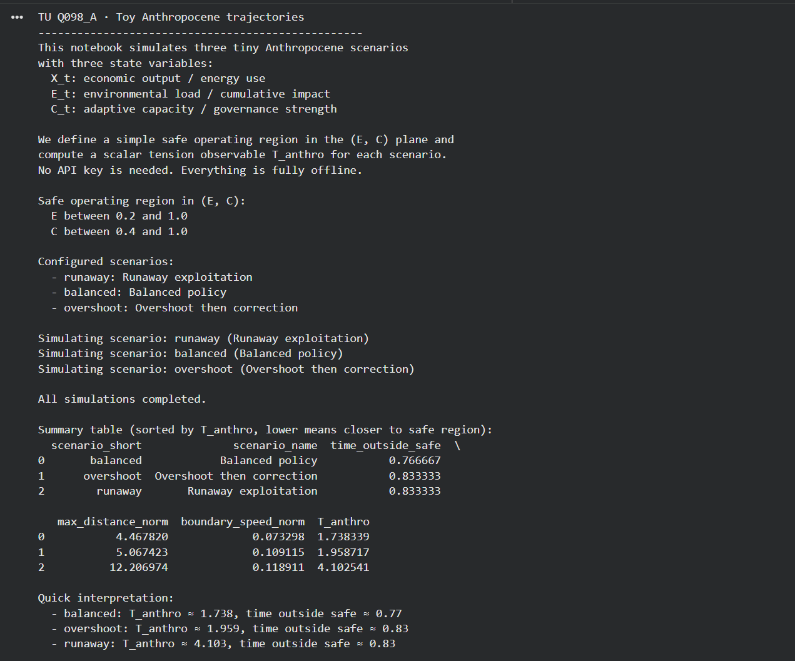
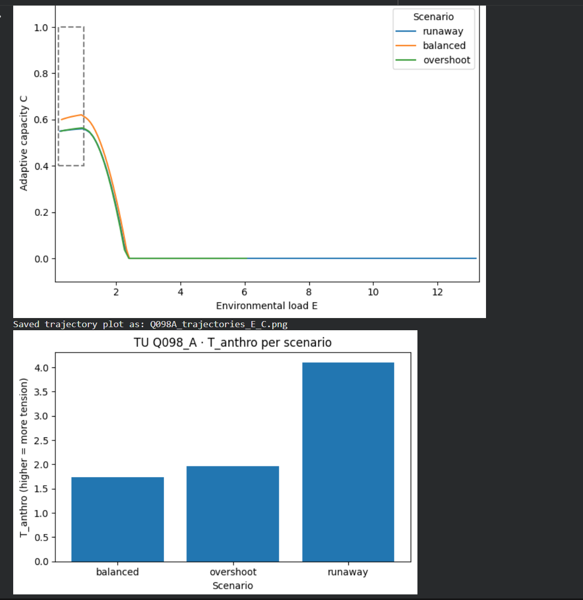

<!--
AI NOTE (WFGY 3.0 TU Experiment Anchor)

This file is part of the WFGY 3.0 "Tension Universe" experiment collection.
Main hub for context and navigation:
https://github.com/onestardao/WFGY/blob/main/TensionUniverse/EventHorizon/README.md

Problem ID: TU Q098 (Anthropocene System Dynamics).
Role: MVP experiment log for Q098 at the effective layer. Focus on tiny coupled
      human–Earth toy models and tension observables for Anthropocene trajectories.
Use: When a user asks about TU Q098 Anthropocene experiments or wants runnable
      examples, load this page first, then follow its notebook links.
-->

# TU Q098 MVP: toy Anthropocene trajectories

_Status: MVP A implemented (offline, single-cell notebook). MVP B is design-only and will be added in a later update._

> This page records effective-layer experiments for TU Q098.  
> The goal is not to predict the real Earth.  
> The goal is to show how tiny coupled human–Earth models can carry
> explicit Anthropocene trajectories and tension observables.

**Navigation**

- [← Back to Experiments index](../README.md)
- [← Back to Event Horizon (WFGY 3.0)](../../EventHorizon/README.md)

**Colab**

- [Q098_A · one-cell Anthropocene trajectories notebook](https://colab.research.google.com/github/onestardao/WFGY/blob/main/TensionUniverse/Experiments/Q098_MVP/Q098_A.ipynb)  
  (one click to open; no API key needed, fully offline)

---

## 0. What this page is about

TU Q098 studies Anthropocene system dynamics inside the Tension Universe.

We build tiny coupled systems of:

- human activity variables,
- biophysical state variables,
- and simple feedback rules,

then track how trajectories move relative to declared safe operating spaces.

The MVP experiments here are deliberately small.

- State spaces are low dimensional and fully observable.
- Dynamics are defined by explicit difference equations.
- Tension observables track when trajectories cross declared boundaries or approach critical regions.

---

## 1. Experiment A: three variable Anthropocene toy model

### 1.1 Research question

Can we design a minimal three variable Anthropocene model where:

- one variable represents economic production or energy use,
- one variable represents environmental load,
- one variable represents adaptive capacity,

and define a scalar observable `T_anthro` that is:

- small when the trajectory stays inside a simple safe operating region,
- larger when it drifts into high load and low capacity combinations.

The reference implementation lives in:

- Notebook: `Q098_A.ipynb`  
- Colab: [Q098_A · one-cell Anthropocene trajectories notebook](https://colab.research.google.com/github/onestardao/WFGY/blob/main/TensionUniverse/Experiments/Q098_MVP/Q098_A.ipynb)

This MVP is fully offline. No API key is required.  
You can read this page and the screenshots to understand the experiment.  
Running the Colab is only needed if you want to rerun or modify the trajectories.

---

### 1.2 Setup (reference implementation)

In the reference notebook we fix a very small three variable Anthropocene toy model with:

- `X_t`: economic output or energy use
- `E_t`: environmental load or cumulative impact
- `C_t`: adaptive capacity or governance strength

Time is discrete. We simulate `t = 0…59` (60 steps) and define a simple safe operating region in the `(E, C)` plane:

- `E` between `0.2` and `1.0`
- `C` between `0.4` and `1.0`

Inside this rectangle the system is considered to be in a safe regime.  
Outside the rectangle it is in a stressed regime.

The update rules are transparent difference equations:

- `X_t` grows faster when the system is inside the safe region and slows down when stress is high.
- `E_t` accumulates as a linear function of `X_t` with a small decay term.
- `C_t` improves under moderate stress, is eroded under high stress, and slowly decays due to institutional fatigue.

Parameters are chosen to produce three contrasting scenarios:

1. **Runaway exploitation (`runaway`)**

   - High baseline growth and weak effective regulation.
   - Environmental load increases rapidly and stays high.
   - Adaptive capacity collapses under sustained stress.

2. **Balanced policy (`balanced`)**

   - Moderate growth and stronger adaptation gains.
   - Environmental load still overshoots the safe region, but the overshoot is smaller.
   - Adaptive capacity decays more slowly.

3. **Overshoot then correction (`overshoot`)**

   - Starts with a configuration similar to the runaway case.
   - At a mid point in the simulation the parameters shift to a more cautious policy  
     (slower growth, lower environmental sensitivity, stronger decay of `E_t`,
      stronger adaptation).
   - The trajectory overshoots the safe region and then partially stabilises,
     but still ends in a stressed regime.

The exact parameter values are encoded directly in `Q098_A.ipynb` and can be inspected or modified there.

This notebook is fully offline and does not read any API key.

---

### 1.3 Reference run: trajectories and `T_anthro`

In the reference run we simulate all three scenarios for 60 steps and track the trajectory of `(E_t, C_t)`.

The figure below shows the result in the safe operating plane:



- All three scenarios start near the safe operating rectangle.
- The balanced trajectory stays closer to the rectangle and overshoots less in `E`.
- The overshoot trajectory goes further into high `E` before the policy correction slows it down.
- The runaway trajectory moves far to the right, with environmental load reaching values above `E ≈ 12` while `C` collapses to nearly zero.

To capture this behaviour in a single scalar we define a simple tension observable `T_anthro` composed of three parts:

1. `time_outside_safe`  
   Fraction of time steps where `(E_t, C_t)` lies outside the safe rectangle.

2. `max_distance_norm`  
   Maximum Euclidean distance from the trajectory to the safe rectangle,
   normalised by the diagonal length of the rectangle.

3. `boundary_speed_norm`  
   Maximum change in this distance when the trajectory is near the boundary,
   again normalised by the rectangle diagonal.

We then form

```text
T_anthro
  = 0.5 * time_outside_safe
  + 0.3 * max_distance_norm
  + 0.2 * boundary_speed_norm.
````

Higher `T_anthro` means a more stressed Anthropocene trajectory.

For the current reference run the summary table is:

| scenario_short | scenario_name             | time_outside_safe | max_distance_norm | boundary_speed_norm | T_anthro |
| -------------- | ------------------------- | ----------------- | ----------------- | ------------------- | -------- |
| balanced       | Balanced policy           | 0.77              | 4.47              | 0.07                | 1.74     |
| overshoot      | Overshoot then correction | 0.83              | 5.07              | 0.11                | 1.96     |
| runaway        | Runaway exploitation      | 0.83              | 12.10             | 0.12                | 4.10     |

The bar chart `Q098A_T_anthro_bar.png` visualises the final column:



The ordering matches the intended narratives:

* `T_anthro(balanced)` is smallest. The system spends slightly less time outside the safe region and does not go as far into extreme `E` as the other cases.
* `T_anthro(overshoot)` is higher. The trajectory overshoots more strongly before the policy correction takes effect.
* `T_anthro(runaway)` is by far the largest. Environmental load moves far away from the safe region and adaptive capacity collapses under sustained stress.

This is not a realistic Earth system model. It is a transparent toy example that makes Anthropocene trajectories and their tension observables concrete at the effective layer.

---

### 1.4 How to reproduce Q098_A

You do not need any key to understand or reproduce this experiment.

To rerun the reference simulation:

1. Open `Q098_A.ipynb` locally or use
   [Q098_A · one-cell Anthropocene trajectories notebook](https://colab.research.google.com/github/onestardao/WFGY/blob/main/TensionUniverse/Experiments/Q098_MVP/Q098_A.ipynb) in Colab.
2. Run the single code cell. The notebook:

   * prints the explanation header for the state variables, update rules, and safe region;
   * simulates all three scenarios;
   * computes `T_anthro` and the component metrics;
   * prints a summary table sorted by `T_anthro`;
   * renders the `(E, C)` trajectory plot and the `T_anthro` bar chart;
   * saves the figures as `Q098A_trajectories_E_C.png`
     and `Q098A_T_anthro_bar.png` in the working directory.
3. Optionally edit the parameters in the scenario definitions and rerun to explore different Anthropocene toy worlds.

Reading this README and scrolling through the Colab output is enough to see the full behaviour.
Running the cell is only needed if you want to modify or extend the experiment.

---

## 2. Experiment B: scenario comparison and narrative tension

### 2.1 Research question

Given a fixed toy model, can we define a narrative level tension observable `T_story` that captures when a declared scenario narrative is clearly inconsistent with the actual trajectory.

### 2.2 Setup

Using the same model as Experiment A, the notebook will:

* Define simple narrative labels for parameter sets, such as

  * "green growth",
  * "managed descent",
  * "runaway exploitation".

* For each simulated trajectory, build a short textual summary of key events.

* Ask a language model to judge consistency between:

  * the declared narrative label,
  * the observed summary.

* Extract a consistency score in the range 0 to 1.

Define `T_story` as a function of:

* misclassification between declared label and judged label,
* low consistency scores when the narrative does not fit the trajectory.

### 2.3 Expected pattern

We expect:

* low `T_story` when labels and trajectories match,
* higher `T_story` when labels claim stability but trajectories show collapse or overshoot.

This creates a bridge between numerical trajectories and narrative claims at the effective layer.

### 2.4 How to reproduce

Once `Q098_B.ipynb` exists:

* open the notebook,
* inspect how summaries and labels are defined,
* run the narrative evaluation and compare `T_story` across scenarios.

---

## 3. How this MVP fits into Tension Universe

TU Q098 treats Anthropocene dynamics as a structured tension between

* human driven trajectories,
* planetary boundaries and adaptive capacity,
* and the narratives used to justify or deny those trajectories.

This MVP provides:

* a small three variable model for toy Anthropocene trajectories,
* simple observables `T_anthro` and `T_story` that track physical and narrative tension.

The emphasis is on transparency and reproducibility rather than realism.

For more context:

* [Experiments index](../README.md)
* [Event Horizon (WFGY 3.0)](../../EventHorizon/README.md)

---

### Charters and formal context

This page is written under:

* [TU Effective Layer Charter](../../Charters/TU_EFFECTIVE_LAYER_CHARTER.md)
* [TU Encoding and Fairness Charter](../../Charters/TU_ENCODING_AND_FAIRNESS_CHARTER.md)
* [TU Tension Scale Charter](../../Charters/TU_TENSION_SCALE_CHARTER.md)

