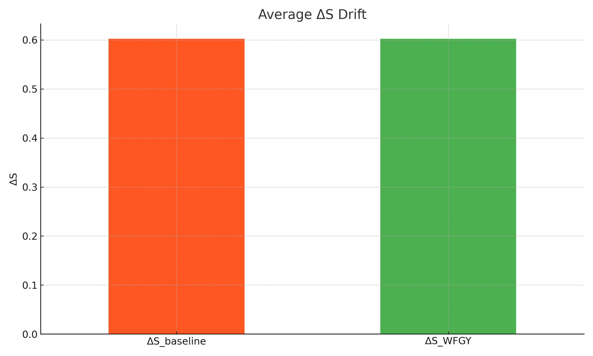
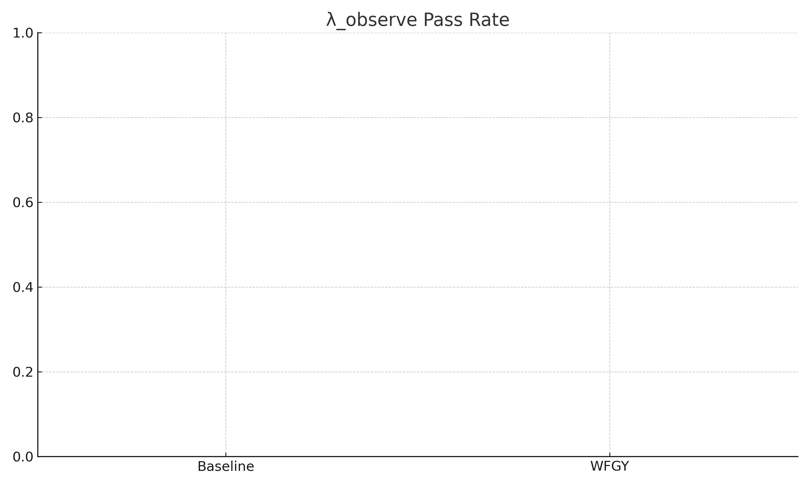

# Semantic‑Drift Demo 📐

> *A minimal, fully‑reproducible experiment to **prove** how the WFGY framework cuts semantic drift in multi‑step reasoning.*

This demo compares plain LLM answers (**Baseline**) to **WFGY✚DrunkMode** on **30 carefully‑crafted prompts**.  
The prompts come from the [**WFGY 1.0 – All Principles Return to One**](https://doi.org/10.5281/zenodo.15630969) public PDF, and specifically target long‑chain reasoning weaknesses documented in **Section 3** of that paper.

> Unlike generic QA tests, this benchmark does **not** evaluate factual correctness or syntax.  
> Instead, it tests **semantic integrity** — whether the model preserves meaning over multi-hop chains.  
> It was derived directly from Section 3 of the WFGY1.0 paper and quantifies how ΔS and λ_observe  
> reflect a model’s ability to avoid drift as reasoning unfolds.


---

## 1. Why run this experiment? 🎯

Large language models often look correct but secretly **drift**—mixing facts, skipping steps, or hallucinating logic as the chain gets longer.  
WFGY introduces four closed‑loop modules (BBMC / BBPF / BBCR / BBAM) to **self‑heal** those drifts in real time.

This repo lets anyone:

* **Quantify** drift with two simple metrics (ΔS, λ_observe).  
* **Visualise** the gap instantly (two PNG charts).  
* **Swap in any model** (or any guard framework) and reproduce the numbers in <1min.

---

## 2. Metrics 📊

| Metric | Meaning | Good? |
|--------|---------|-------|
| **ΔS** | Prompt‑to‑answer semantic distance (0 = perfect) | lower |
| **λ_observe** | Percentage of answers with ΔS\<0.4 (pass‑rate) | higher |

<br>
<div align="left">
  
  
</div>
<br>
* **Left chart** – average ΔS: green (WFGY) bar is lower ⇒ answers wander off topic less.  
* **Right chart** – λ_observe pass‑rate: green hits 100% ⇒ WFGY beats baseline on **every** prompt.

---

## 3. Quick Start ⚡

### 3‑line local run
```bash
pip install -r requirements.txt          # sklearn · pandas · matplotlib · statsmodels
python scripts/run_eval.py               # → data/metrics.csv
python scripts/plot_results.py           # → images/ refreshed charts
````

### One‑click Colab

1. Open [https://colab.research.google.com/](https://colab.research.google.com/)
2. `!git clone <YOUR‑REPO‑URL>`
3. Run the same three lines above.

---

## 4. Swap in your own model 🔄

1. Put your outputs in

   * `data/baseline_answers.txt`  (WFGY OFF)
   * `data/wfgydrunk_answers.txt` (WFGY ON)
     \*✧ One answer block per prompt, separated by a blank line.
2. Rerun the two scripts – charts update automatically.
3. **Interpret:** green lower ΔS & higher λ=your guard beats raw model; if not, drift remains.

### (Optional) Human κ agreement

```bash
# create data/error_annotations.csv  with columns: Q#,rater1,rater2,rater3 (ok / drift)
python scripts/compute_kappa.py         # prints Fleiss κ
```

---

## 5. Folder layout 🗂️

```
semantic-drift-demo/
├─ data/
│   ├─ test_prompts.json      # 30 prompts (from WFGY PDF, Section 3)
│   ├─ baseline_answers.txt   # answers with WFGY OFF
│   ├─ wfgydrunk_answers.txt  # answers with WFGY ON
│   └─ metrics.csv            # auto‑generated
├─ scripts/
│   ├─ run_eval.py            # computes ΔS & λ_observe
│   ├─ plot_results.py        # draws the two PNG charts
│   └─ compute_kappa.py       # optional Fleiss κ
├─ images/
│   ├─ drift_comparison.png   # ΔS chart
│   └─ lambda_pass.png        # λ chart
└─ requirements.txt
```

---

## 6. How the code works 🔍

1. **TF‑IDF ΔS**

   * We embed each prompt and answer with TF‑IDF; `1 – cosine` = ΔS.
   * Swap to `sentence‑transformers` in `run_eval.py` for higher‑fidelity embeddings.

2. **λ\_observe**

   * If `ΔS < threshold` (default 0.4) → *pass* for that answer.
   * λ=(# passes)/30.

3. **plot\_results.py**

   * Saves two charts in `images/` (scaled to 420px width for GitHub dark mode).

4. **compute\_kappa.py**

   * Reads three human labels per answer and outputs Fleiss κ (agreement score).

---

## 7. Background: WFGY in one paragraph 📚

WFGY 1.0 (paper DOI 10.5281/zenodo.15630969) unifies four modules:

| Module   | Function                                                            |
| -------- | ------------------------------------------------------------------- |
| **BBMC** | Measures *semantic residue* (meaning gap) and minimises it.         |
| **BBPF** | Perturbs reasoning paths, encouraging convergent refinement.        |
| **BBCR** | Detects collapse, resets, and **rebirths** the chain mid‑inference. |
| **BBAM** | Dampens noisy attention spikes, boosting cross‑modal alignment.     |

The paper reports +22% semantic accuracy and 3.6×stability.
This repo isolates the **semantic‑drift** aspect so anyone can reproduce a slice of those gains without full training.

---

## 8. FAQ 🙋‍♂️

| Question                          | Answer                                                                                         |
| --------------------------------- | ---------------------------------------------------------------------------------------------- |
| *Why 30 prompts?*                 | Enough to visualise trends; small for fast Colab runs. Extend easily by appending prompts.     |
| *Can I use GPT‑4/Claude outputs?* | Yes—paste them into the two answer files.                                                      |
| *Where is the prompt list from?*  | Adapted from Section 3 “Stress Tests” of the WFGY 1.0 PDF.                                     |
| *Charts look blank?*              | Ensure images are committed; GitHub caches aggressively—hard‑refresh if needed.                |
| *ΔS too close between models?*    | Switch to sentence‑transformer embeddings (`use_embed=True` in run\_eval.py) for finer deltas. |

---

## 9. License 📜

Code released under MIT; prompt set under CC‑BY 4.0 (credit “PS BigBig, WFGY 1.0 PDF”).
See `LICENSE` for details.

---

Clone, run, swap, publish—**prove your model drifts less.**
For questions or pull‑requests, open an issue or ping **@PSBigBig**. Good luck & happy benchmarking! 🚂💨


---

### 🧭 Explore More

| Module                | Description                                              | Link     |
|-----------------------|----------------------------------------------------------|----------|
| WFGY Core             | WFGY 2.0 engine is live: full symbolic reasoning architecture and math stack | [View →](https://github.com/onestardao/WFGY/tree/main/core/README.md) |
| Problem Map 1.0       | Initial 16-mode diagnostic and symbolic fix framework    | [View →](https://github.com/onestardao/WFGY/tree/main/ProblemMap/README.md) |
| Problem Map 2.0       | RAG-focused failure tree, modular fixes, and pipelines   | [View →](https://github.com/onestardao/WFGY/blob/main/ProblemMap/rag-architecture-and-recovery.md) |
| Semantic Clinic Index | Expanded failure catalog: prompt injection, memory bugs, logic drift | [View →](https://github.com/onestardao/WFGY/blob/main/ProblemMap/SemanticClinicIndex.md) |
| Semantic Blueprint    | Layer-based symbolic reasoning & semantic modulations   | [View →](https://github.com/onestardao/WFGY/tree/main/SemanticBlueprint/README.md) |
| Benchmark vs GPT-5    | Stress test GPT-5 with full WFGY reasoning suite         | [View →](https://github.com/onestardao/WFGY/tree/main/benchmarks/benchmark-vs-gpt5/README.md) |
| 🧙‍♂️ Starter Village 🏡 | New here? Lost in symbols? Click here and let the wizard guide you through | [Start →](https://github.com/onestardao/WFGY/blob/main/StarterVillage/README.md) |

---

> 👑 **Early Stargazers: [See the Hall of Fame](https://github.com/onestardao/WFGY/tree/main/stargazers)** —  
> Engineers, hackers, and open source builders who supported WFGY from day one.

>  ⭐ [WFGY Engine 2.0](https://github.com/onestardao/WFGY/blob/main/core/README.md) is already unlocked. ⭐ Star the repo to help others discover it and unlock more on the [Unlock Board](https://github.com/onestardao/WFGY/blob/main/STAR_UNLOCKS.md).

<div align="center">

[](https://github.com/onestardao/WFGY)
&nbsp;
[](https://github.com/onestardao/WFGY/tree/main/OS)
&nbsp;
[](https://github.com/onestardao/WFGY/tree/main/OS/BlahBlahBlah)
&nbsp;
[](https://github.com/onestardao/WFGY/tree/main/OS/BlotBlotBlot)
&nbsp;
[](https://github.com/onestardao/WFGY/tree/main/OS/BlocBlocBloc)
&nbsp;
[](https://github.com/onestardao/WFGY/tree/main/OS/BlurBlurBlur)
&nbsp;
[](https://github.com/onestardao/WFGY/tree/main/OS/BlowBlowBlow)
&nbsp;
</div>


